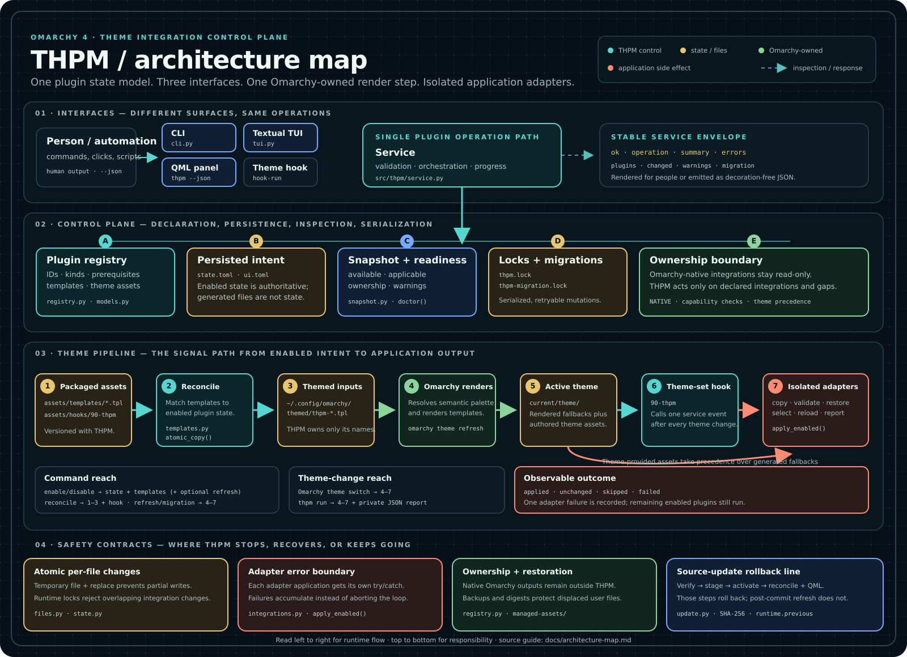

# THPM architecture map



This map is a teaching view of THPM's runtime architecture. Read it **left to right** for execution flow and **top to bottom** for responsibility. It intentionally favors the stable architectural contracts over every adapter-specific branch.

## The central idea

THPM does not render an entire Omarchy theme itself. It maintains plugin intent and the integration layer around Omarchy's renderer:

1. All user interfaces reach the same Python service operations.
2. THPM reconciles its packaged templates into Omarchy's themed-input directory.
3. Omarchy resolves the active semantic palette and renders those templates.
4. Omarchy invokes one THPM hook after a theme change.
5. The hook applies enabled integrations through isolated adapters.

That separation is why a plugin can be **enabled** without its target application file being the source of truth. Enabled state comes from THPM state; generated files are outputs that can be rebuilt.

## 01 — Interfaces

The CLI, QML panel, and Textual TUI share one plugin-operation model:

- The CLI parses commands and renders either human output or stable JSON in [`src/thpm/cli.py`](../src/thpm/cli.py).
- The QML panel invokes `thpm --json`; it does not duplicate plugin state or mutation logic. Its packaged source is [`assets/qml/Panel.qml.in`](../assets/qml/Panel.qml.in).
- The TUI calls the same `Service` in background workers in [`src/thpm/tui.py`](../src/thpm/tui.py).
- [`Service`](../src/thpm/service.py) owns plugin-state and integration orchestration, validation, progress stages, and response envelopes. UI installation and removal remain narrow CLI-dispatched deployment operations.

The installed theme hook is also a narrow service client. [`assets/hooks/90-thpm`](../assets/hooks/90-thpm) converts Omarchy's `theme-set` event into `thpm hook-run theme-set`.

A service response always begins with the envelope fields `schemaVersion`, `ok`, `operation`, `busy`, and `summary`. Operations then add structured fields such as `plugins`, `changed`, `warnings`, `errors`, or `migration`.

## 02 — Control plane

### Registry

[`src/thpm/registry.py`](../src/thpm/registry.py) declares the supported plugins and their stable metadata:

- ID, label, category, and kind
- required commands
- theme-provided asset names
- generated-template names
- default enabled state and confirmation policy

`NATIVE` records describe integrations owned by Omarchy. THPM exposes those as read-only architecture boundaries instead of pretending to manage them.

### Persisted state

[`src/thpm/state.py`](../src/thpm/state.py) loads plugin intent from:

```text
$XDG_STATE_HOME/thpm/state.toml
```

Missing state falls back to registry defaults. Only known boolean plugin values are accepted from the file. Mutations save through a temporary file and atomic replacement.

User-editable behavior lives at:

```text
$XDG_CONFIG_HOME/thpm/config.toml
```

[`src/thpm/config.py`](../src/thpm/config.py) validates and atomically writes the restart policy shared by hooks, CLI, GUI, and TUI. It is configuration rather than discovered runtime state.

The frontend preference is separate and lives at:

```text
$XDG_STATE_HOME/thpm/ui.toml
```

It chooses whether the Omarchy Menu entry opens the QML panel or TUI; it does not create a second plugin-state model.

### Snapshots and readiness

[`src/thpm/snapshot.py`](../src/thpm/snapshot.py) combines registry declarations, persisted intent, application probes, active-theme assets, and compatibility checks into the plugin views consumed by every interface.

Important view concepts are deliberately distinct:

- **enabled** — persisted THPM intent
- **available** — required application or asset prerequisites exist
- **applicable** — a conditional compatibility integration is requested by this theme
- **ownership** — `thpm`, `native`, or `unavailable`
- **warnings** — enabled state cannot currently be applied cleanly

The same readiness functions are used by snapshots, enable policy, Doctor, and hook execution so the interfaces and runtime cannot silently disagree.

### Locks and migrations

[`src/thpm/state.py`](../src/thpm/state.py) provides two non-blocking advisory locks:

```text
$XDG_RUNTIME_DIR/thpm.lock
$XDG_RUNTIME_DIR/thpm-migration.lock
```

The mutation lock serializes plugin-state and managed integration-file changes. The separate migration lock serializes versioned refresh migrations without holding the mutation lock while Omarchy invokes the theme hook. UI surface deployment and the independent updater have their own paths rather than sharing this mutation lock.

Versioned migration markers live beneath:

```text
$XDG_STATE_HOME/thpm/migrations/
```

A failed refresh leaves its migration pending so a later `thpm reconcile` can retry it.

## 03 — Theme pipeline

### 1. Packaged assets

THPM ships versioned templates in [`assets/templates/`](../assets/templates/) and one hook at [`assets/hooks/90-thpm`](../assets/hooks/90-thpm).

### 2. Reconcile

[`src/thpm/templates.py`](../src/thpm/templates.py) computes two sets:

- templates owned by THPM
- templates wanted by currently enabled plugins

It copies changed wanted templates, removes disabled or obsolete THPM templates, and leaves unrelated files alone. [`Service.reconcile`](../src/thpm/service.py) also atomically reinstalls the hook.

### 3. Themed inputs

Reconciled templates are placed under:

```text
$XDG_CONFIG_HOME/omarchy/themed/thpm-*.tpl
```

These are inputs to Omarchy, not final application configuration.

### 4. Omarchy rendering

`omarchy theme refresh` resolves the active theme's canonical semantic palette and renders the themed inputs. Omarchy owns this stage; THPM does not maintain a competing palette derivation or renderer.

### 5. Active theme

Rendered THPM fallbacks appear in Omarchy's active-theme directory alongside authored theme assets:

```text
$XDG_STATE_HOME/omarchy/current/theme/
```

When an integration supports both, an explicit theme-provided asset takes precedence over THPM's generated fallback. Generated fallbacks containing unresolved `{{ ... }}` placeholders are rejected before deployment.

### 6. Theme-set hook

After rendering or switching a theme, Omarchy invokes:

```text
$XDG_CONFIG_HOME/omarchy/hooks/theme-set.d/90-thpm
```

The wrapper calls `Service.hook_run()`, which acquires the mutation lock and passes current enabled state to `apply_enabled()`. During `thpm run`, the hook also writes presentation-neutral integration start and finish events to a private JSON Lines channel while preserving a separate final JSON report.

### 7. Isolated adapters

[`src/thpm/integrations.py`](../src/thpm/integrations.py) contains readiness probes and application adapters. Depending on the plugin, an adapter may:

- copy a generated or authored asset
- insert a managed import block
- validate and normalize content
- select a theme inside an application
- invoke a bounded reload command
- restore a displaced file when THPM relinquishes ownership

After readiness inspection, `apply_enabled()` wraps each adapter application in its own error boundary. An adapter failure is recorded without stopping later adapters. Results use four stable statuses:

| Status | Meaning |
|---|---|
| `applied` | Files changed or an application action ran |
| `unchanged` | The integration was already synchronized |
| `skipped` | Prerequisites were not actionable |
| `failed` | The adapter raised or returned a failure |

## Command reach

| Command or event | State | Templates + hook | Omarchy render | Adapters |
|---|---:|---:|---:|---:|
| `thpm enable ID` | writes | reconciles | yes by default | through refresh |
| `thpm disable ID` | writes | reconciles and cleans managed output | no | no |
| `thpm reconcile` | reads | reconciles | only for a pending migration | only if refreshed |
| `thpm reconcile --refresh` | reads | reconciles | yes | yes |
| `thpm run` | reads | assumes present | yes | yes, with live private events and a final report |
| Omarchy theme switch | reads in hook | assumes present | Omarchy-owned | yes |

A plain reconcile can therefore do more during a pending template-schema migration than it does after that migration has completed.

## 04 — Safety contracts

### Atomicity and concurrency

[`src/thpm/files.py`](../src/thpm/files.py) writes individual managed files with temporary-file replacement. Runtime locks reject overlapping integration mutations. These mechanisms prevent partial individual writes and concurrent integration changes, but they do not turn a multi-file reconciliation into one filesystem transaction.

### Restoration rather than blind deletion

For optional assets and managed outputs, [`src/thpm/integrations.py`](../src/thpm/integrations.py) records ownership metadata and backups under:

```text
$XDG_STATE_HOME/thpm/managed-assets/
```

Digests distinguish the file THPM installed from a file changed later by the user. Cleanup restores known prior content and preserves targets THPM can no longer prove it owns.

### Adapter isolation

The hook loop catches failures raised while applying each adapter. The overall operation can report failure while still returning successful results and changed paths from other integrations. Readiness inspection happens before that adapter boundary.

### Source-update rollback line

[`src/thpm/update.py`](../src/thpm/update.py) treats source updates as two failure regions:

1. **Rollbackable:** download and SHA-256 verification, isolated runtime staging, activation, reconciliation, and QML deployment. Activation failure restores the previous runtime and THPM-owned integration surfaces.
2. **Committed:** the old runtime is removed before the active theme is refreshed. A refresh failure is reported as partial failure with `thpm reconcile --refresh` as the recovery command; it does not roll back the new runtime.

Package-managed installations remain owned by pacman/AUR and use their package-manager update path instead of THPM overwriting them.

## Exact path reference

All user paths are centralized in [`src/thpm/paths.py`](../src/thpm/paths.py). With default XDG locations, the major surfaces are:

| Purpose | Default path |
|---|---|
| User preferences | `~/.config/thpm/config.toml` |
| Plugin state | `~/.local/state/thpm/state.toml` |
| UI preference | `~/.local/state/thpm/ui.toml` |
| Active theme | `~/.local/state/omarchy/current/theme/` |
| Managed restoration state | `~/.local/state/thpm/managed-assets/` |
| THPM themed inputs | `~/.config/omarchy/themed/thpm-*.tpl` |
| Theme hook | `~/.config/omarchy/hooks/theme-set.d/90-thpm` |
| QML shell plugin | `~/.config/omarchy/plugins/io.github.oldjobobo.thpm/` |
| Omarchy Menu extension | `~/.config/omarchy/extensions/omarchy-menu.jsonc` |

For the prose contract behind the map, continue with [`architecture.md`](architecture.md). For individual plugin behavior and security expectations, see [`plugins.md`](plugins.md).
