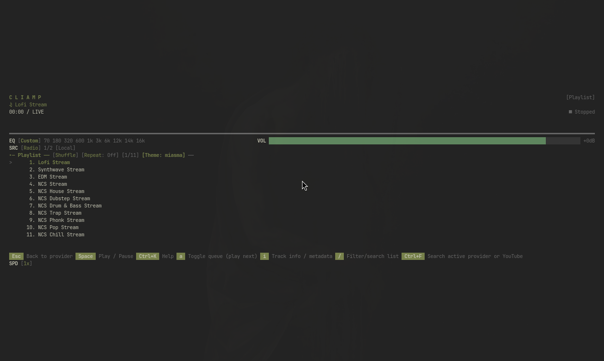
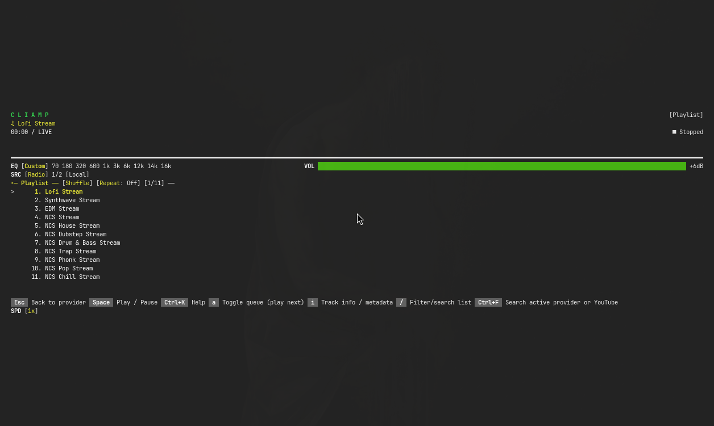

# CLIamp native-default and authored-override evidence

Captured on 2026-08-27 from behavior commit
`c58420b48d9d40a22c716e72bf53437521a20a83`, packaged as local Arch build
`thpm 1.0.0rc22-102` and installed on the Quattro Omarchy test VM.

Package SHA-256:

```text
d805f1a02409c398e558dd840724fc52ada6168f911389351819d26ed1fb9a8c
```

Environment:

- CLIamp v1.63.2
- `GDK_SCALE=1`
- isolated temporary HOME trees
- CLIamp public `radio` provider only
- no personal providers, playlists, listening history, accounts, credentials, paths,
  notifications, or background applications in either capture

## Native default



The active Omarchy theme supplied `colors.toml` but no opted-in `cliamp.toml`.
The installed production hook reported CLIamp `unchanged` with `changed: []`.
The existing CLIamp configuration remained byte-identical and no
`themes/omarchy.toml` was created:

```text
config before: 522e3e22be1914153d8b5b9a17821e0b8d0f9ea99f90e01607ffcf344db49849
config after:  522e3e22be1914153d8b5b9a17821e0b8d0f9ea99f90e01607ffcf344db49849
managed theme: absent
```

CLIamp visibly reports `[Theme: miasma]`. Its native dark olive key surfaces use
light labels; no light-foreground-on-light-background defect is present.

Image SHA-256:

```text
78cdec7ab331849544748ae5bcd79e39aac064537a4f4651cc781fe3aa957b3a
```

## Explicit authored override



The active theme supplied an authored `cliamp.toml` containing:

```toml
# thpm:cliamp-use-native
```

The production hook installed the file byte-for-byte and changed only the
isolated selector from `miasma` to `omarchy`, preserving its inline comment and
unrelated `volume` setting. Source and installed files shared this SHA-256:

```text
75e8029e511b53fe10c4efb1158a044f76170d6e2eeaff64e8e07d0e0bcb7105
```

The authored palette uses dark key/help surfaces with light labels; no
light-foreground-on-light-background defect is present.

After the authored file disappeared, the production hook restored the original
configuration byte-for-byte and removed the managed override:

```text
restored config: 283100c75fb82c9f0ce07b1e34c54d1ba0b67a1429f7410e5f8de0a536062a19
managed theme:  absent
```

Image SHA-256:

```text
41e06d8a36faa72bd4213c4d6816407fb53497c24778a920b38e4e8ac3241478
```

## Historical correction

The earlier generated Miasma screenshot at revision
`d83da95a8301f1f6467f23757c845d082d2cbb3b` documents the superseded,
contrast-defective generated-fallback behavior. It is not evidence for this
corrected contract and is intentionally not reused here.
